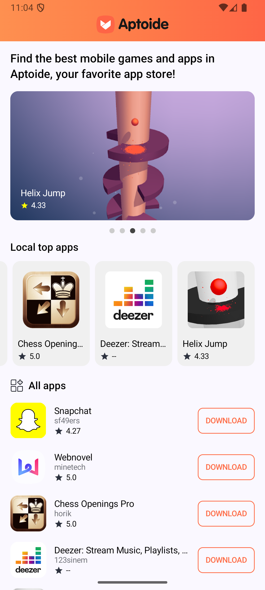
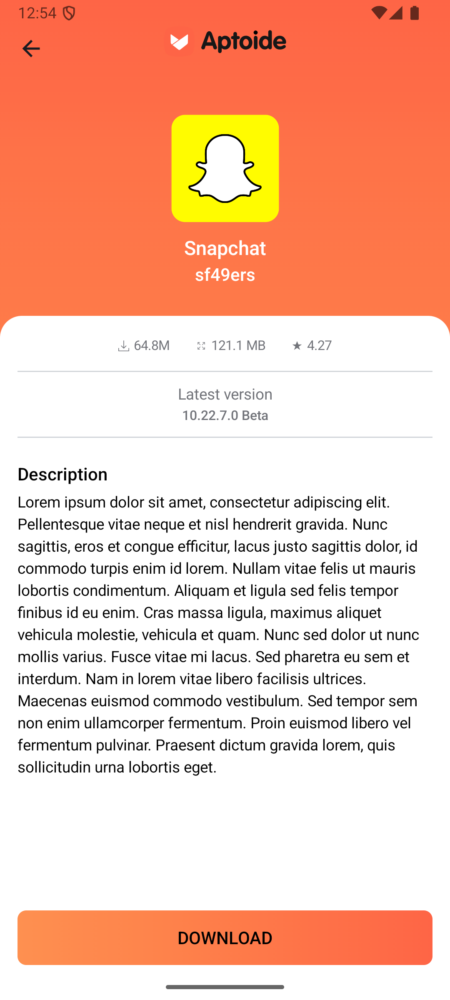
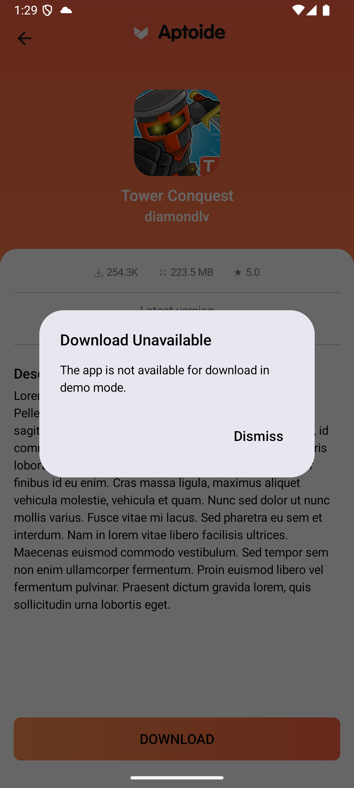
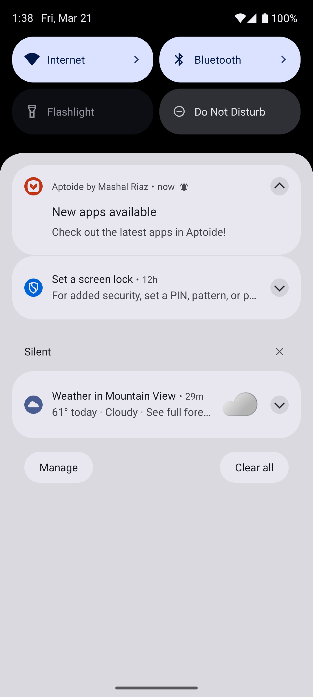

# Aptoide Android Demo  
A simple Android client for browsing Aptoide apps featuring offline caching, periodic notifications, and MVVM + Clean Architecture.  

**Thank you for taking the time to review my code. Your feedback is greatly appreciated.**

## APK Download  
[Download the latest debug APK here!](./apk/aptoide-demo.apk)

## Screenshots  
| Home | Detail | Download Dialog | Notifications |  
|------|--------|-----------------|---------------|  
|  |  |  |  |

## Features  
- Fetch and display apps from the Aptoide API  
- Detail screen with a "Download" button for app installation  
- Offline support using Room database caching  
- Background notifications every 30 minutes via WorkManager  
- MVVM architecture with Clean Architecture separation  
- Modern UI built with Jetpack Compose and Material3 

## Technical Implementation  
### Layer Breakdown  
| Layer        | Technology/Library       | Rationale |  
|--------------|--------------------------|-----------|  
| **UI**       | Jetpack Compose          | Enables declarative and efficient UI development |  
| **ViewModel**| AndroidX ViewModel + StateFlow | Manages lifecycle-aware UI state |  
| **Domain**   | UseCases (Interactors)   | Encapsulates reusable business logic |  
| **Data**     | Retrofit2 + Room | Handles API calls, local caching |  
| **DI**       | Hilt                     | Simplifies dependency injection across layers |  
| **Navigation**| Navigation-Compose      | Provides type-safe screen transitions |  

## Architecture Decisions  
### MVVM with Clean Architecture  
I chose MVVM coupled with Clean Architecture because the project requirements demanded clear separation between data fetching, caching, and UI presentation. Clean Architecture enforces this separation through distinct Data, Domain, and Presentation layers, ensuring each component has a single responsibility.  

The ViewModel layer survives configuration changes, preventing unnecessary data reloads during screen rotations. A single `uiState: StateFlow<HomeViewState>` streamlines state management for Jetpack Compose, aligning with the assignment's reactive UI requirements. This structure also isolates business logic in testable ViewModels, enabling straightforward unit testing with JUnit4 and MockK.  

## Testing Approach  
While I implemented core test cases (visible in commit history), time constraints limited full test coverage. Key testing efforts include:  
- ViewModel tests using MockK to verify state transitions  
- Parameterized tests for download count formatting and rating display logic  
- WorkManager tests for notification scheduling  

Notably, during testing I identified and resolved a caching issue where stale data wasn't being properly invalidated.  

## Future Improvements  
Given additional time, I would prioritize the following enhancements:  

1. **UI Testing**  
Implement comprehensive UI tests using Jetpack Compose Test to validate user interactions and screen states.  

2. **Loading State Refinement**  
Enhance loading indicators with full-screen progress visuals during API refreshes to better communicate active data updates.

3. **Data Freshness**  
Add a swipe-to-refresh mechanism and timestamp-based cache invalidation to ensure users see updated app listings.  

4. **Error Handling**  
Replace generic `.toString()` usages with proper null checks and fallback values for missing API data fields.  

5. **Image Caching**  
Implement Coil with disk caching strategies to reduce redundant network requests for app icons.  

6. **Pagination**  
Integrate Paging3 for infinite scrolling and efficient large dataset handling.  

7. **Dark Theme**  
Add full Material3 dynamic color support with dark/light mode customization.  
